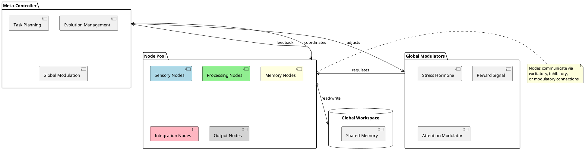
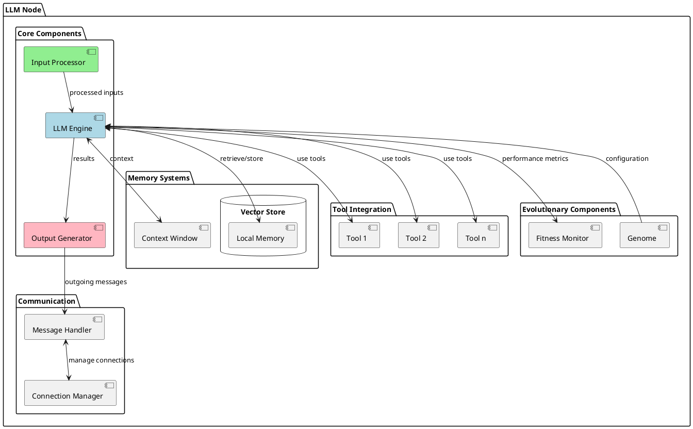
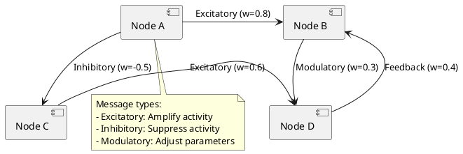
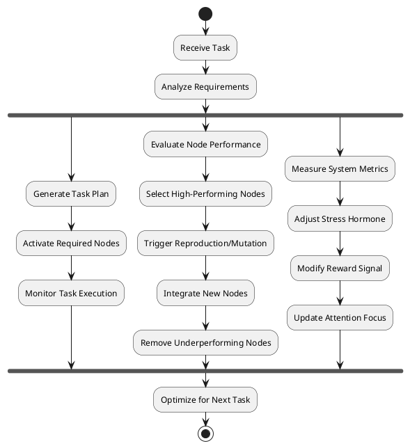
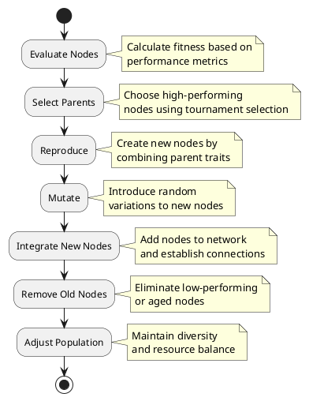
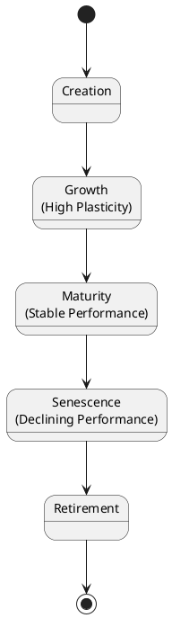
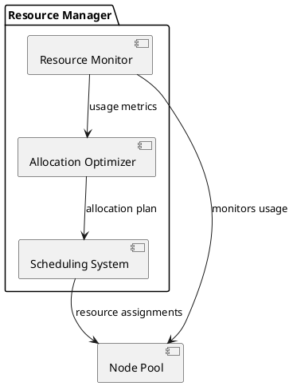

# Distributed Brain-Inspired AI Network (DBIAN): A Theoretical Framework

## Abstract

This paper presents a theoretical framework for a Distributed Brain-Inspired AI Network (DBIAN), an advanced computational architecture that integrates Large Language Models (LLMs) with neural network principles and biological brain structures. The system is designed as a network of specialized LLM nodes with dedicated tools and memory, communicating through standardized protocols inspired by biological neurotransmission. The architecture incorporates evolutionary features that enable continuous adaptation and optimization. Drawing from neuroscience, evolutionary biology, and cutting-edge AI research, this framework provides a roadmap for developing more adaptive, scalable, and biologically plausible artificial intelligence systems.

## 1. Introduction

### 1.1 Background and Motivation

Contemporary artificial neural networks, despite their biological inspiration, have largely diverged from accurately modeling brain function in favor of engineering efficiency. This divergence has created opportunities for novel architectures that better capture the distributed, specialized, and adaptive nature of biological neural systems.

Large Language Models (LLMs) have demonstrated remarkable capabilities in reasoning, knowledge representation, and adaptability. However, they typically function as monolithic systems rather than as components of a distributed, brain-like architecture. The DBIAN framework proposes integrating LLMs as specialized nodes within a broader neural network structure, combining the strengths of both paradigms.

### 1.2 Objectives

This research aims to:

- Develop a theoretical framework for a distributed AI system inspired by biological neural networks
- Integrate LLMs as functional analogs to specialized brain regions
- Incorporate evolutionary mechanisms for continuous system improvement
- Define mathematical models for node operation, communication, learning, and evolution
- Explore the potential for emergent intelligence through distributed processing

### 1.3 Scope and Limitations

This paper focuses on the theoretical foundation and architectural design of DBIAN rather than implementation details. While we provide mathematical models and suggest technical approaches, a full implementation would require significant computational resources beyond the scope of this theoretical work. We acknowledge that our biological analogies are abstractions rather than precise replications of neural processes.

## 2. Theoretical Foundation

### 2.1 Biological Neural Systems

The human brain serves as the primary inspiration for our architecture, with its network of approximately 86 billion neurons connected via an estimated 100 trillion synapses [1]. Key features of biological neural systems incorporated in our design include:

- **Distributed Processing**: The brain processes information across multiple specialized regions rather than in a central processor.
- **Specialization**: Brain regions are adapted for specific functions (e.g., visual cortex, language areas).
- **Plasticity**: Neural connections strengthen or weaken based on usage and learning.
- **Neurotransmission**: Neurons communicate via chemical signals that can be excitatory, inhibitory, or modulatory.
- **Global Regulation**: Hormonal systems adjust brain-wide parameters based on conditions.
- **Evolutionary Development**: The brain structure has evolved through natural selection.

### 2.2 From Artificial Neurons to LLM Nodes

Traditional artificial neural networks use simple computational units (artificial neurons) that perform weighted summation followed by activation. In contrast, our DBIAN architecture replaces these units with more sophisticated LLM-based nodes:

```
Traditional Neuron: y = σ(∑(w_i * x_i) + b)
LLM Node: y = LLM(inputs, context, tools, memory)
```

This substitution enables each node to perform complex reasoning, maintain context, use specialized tools, and access memory systems while still operating within a larger network structure.

### 2.3 Brain-Inspired Information Processing

The DBIAN architecture implements several brain-inspired information processing principles:

- **Hierarchical Processing**: Information flows through stages of increasing abstraction.
- **Parallel Processing**: Multiple pathways process information simultaneously.
- **Recurrent Processing**: Feedback loops allow iterative refinement.
- **Context Integration**: Current processing is influenced by prior context and memory.
- **Global Workspace**: A shared information space enables integration across specialized modules.

## 3. DBIAN Architecture

### 3.1 High-Level System Design

The DBIAN is a modular, distributed system comprising specialized nodes connected in a dynamic graph, orchestrated by a meta-controller, and regulated by global modulators.



#### 3.1.1 Components

1. **Nodes (Agents)**:
   - Each node is an autonomous agent with:
     - An LLM for processing and generating information
     - A vector store for local memory
     - Tools (sub-agents) for specific tasks
   - Specializations include:
     - Sensory Nodes: Process inputs like visual, auditory, or textual data
     - Processing Nodes: Handle reasoning, pattern recognition, or decision-making
     - Memory Nodes: Manage long-term storage and retrieval
     - Integration Nodes: Combine information from multiple nodes
     - Output Nodes: Generate responses or actions

2. **Communication Network**:
   - Nodes form a dynamic graph G = (V, E), where V is the set of nodes and E represents weighted connections
   - Communication types (inspired by neurotransmitters):
     - Excitatory: Amplify activity in receiving nodes
     - Inhibitory: Suppress activity
     - Modulatory: Adjust parameters like learning rates or attention

3. **Meta-Controller**:
   - An LLM-based controller that:
     - Analyzes tasks or inputs
     - Generates plans specifying node activation sequences
     - Manages evolutionary processes
     - Adjusts global modulators based on performance

4. **Global Workspace**:
   - A shared memory space for integrating information across nodes
   - Analogous to the brain's global workspace theory of consciousness
   - Implemented as a shared vector store accessible by all nodes

5. **Global Modulators ("Hormones")**:
   - System-wide parameters regulating behavior:
     - Stress Hormone: Increases exploration during poor performance
     - Reward Signal: Reinforces successful paths
     - Attention Modulator: Prioritizes nodes or pathways

### 3.2 Node-Level Architecture

Each node in the network functions as an advanced artificial neuron with enhanced capabilities through an embedded LLM.



#### 3.2.1 Components

1. **Core LLM Component**:
   - Handles reasoning and decision-making
   - Processes inputs and generates outputs
   - Configured by the node's genetic representation

2. **Input Processing**:
   - Receives signals from connected nodes
   - Applies weights and transformations
   - Formats inputs for LLM processing

3. **Tool Integration**:
   - Specialized tools for specific tasks
   - May include vision modules, reasoning engines, or database connectors
   - Tools can be inherited, modified, or developed through evolution

4. **Memory Systems**:
   - Vector store for information retrieval and storage
   - Context window for immediate processing
   - Memory management for efficiency

5. **Communication Interface**:
   - Standardized protocol for messaging
   - Connection management for dynamic network topology
   - Message prioritization and filtering

6. **Evolutionary Components**:
   - Genome defining node characteristics
   - Fitness monitoring for evolutionary selection
   - Adaptation mechanisms for self-improvement

### 3.3 Communication Network

Nodes exchange information through a structured communication network inspired by biological neural connectivity:



#### 3.3.1 Message Types

1. **Excitatory Messages**:
   - Increase the likelihood of the receiving node activating
   - Carry positive weights
   - Used for information that should amplify or reinforce processing

2. **Inhibitory Messages**:
   - Decrease the likelihood of the receiving node activating
   - Carry negative weights
   - Used for information that should suppress or constrain processing

3. **Modulatory Messages**:
   - Adjust parameters in the receiving node
   - Affect learning rates, attention, or other meta-parameters
   - Enable context-dependent processing adjustments

#### 3.3.2 Connection Dynamics

Connections between nodes are dynamic, changing based on:

- Learning (Hebbian mechanisms)
- Evolutionary processes
- Task requirements
- Meta-controller directives

### 3.4 Meta-Controller Functionality

The meta-controller serves as a central coordinator, optimizing the network's operation without directly processing task inputs:



#### 3.4.1 Task Planning

The meta-controller analyzes incoming tasks and generates plans specifying:

- Which nodes should activate and in what sequence
- The flow of information between nodes
- Allocation of computational resources
- Success criteria and evaluation metrics

#### 3.4.2 Evolution Management

For the evolutionary aspects of the system, the meta-controller:

- Evaluates node performance on tasks
- Selects high-performing nodes as parents
- Oversees reproduction and mutation processes
- Integrates new nodes into the network
- Removes underperforming or obsolete nodes

#### 3.4.3 Global Modulation

The meta-controller adjusts system-wide parameters:

- Stress hormone levels based on error rates
- Reward signals based on successful task completion
- Attention modulators to focus resources on priority tasks

### 3.5 Global Workspace and Modulators

The global workspace and modulator systems facilitate integration and regulation across the network:

```plantuml
@startuml Global Systems

database "Global Workspace" {
  [Shared Vector Store]
  [Integration Space]
  [Broadcast Mechanism]
}

package "Global Modulators" {
  [Stress Hormone] #LightRed
  [Reward Signal] #LightGreen
  [Attention Modulator] #LightBlue
}

[Node 1] --> [Shared Vector Store] : write
[Node 2] --> [Shared Vector Store] : write
[Shared Vector Store] --> [Node 3] : read
[Shared Vector Store] --> [Node 4] : read

[Integration Space] <--> [Broadcast Mechanism] : integrated information

[Stress Hormone] --> [Node 1] : modulate
[Reward Signal] --> [Node 2] : reinforce
[Attention Modulator] --> [Node 3] : prioritize

@enduml
```

#### 3.5.1 Global Workspace

The global workspace functions as a system-wide integration mechanism:

- Allows nodes to contribute information to a shared space
- Enables information broadcast to relevant nodes
- Facilitates the emergence of system-wide coherence
- Implements attention mechanisms through prioritization

#### 3.5.2 Global Modulators

Global modulators adjust system-wide behavior based on conditions:

1. **Stress Hormone**:
   - Increases when performance is poor or tasks are challenging
   - Promotes exploration and node diversity
   - Adjusts learning rates system-wide

2. **Reward Signal**:
   - Strengthens pathways that lead to successful outcomes
   - Reinforces effective node connections
   - Guides the evolutionary selection process

3. **Attention Modulator**:
   - Focuses resources on high-priority tasks or inputs
   - Adjusts node activation thresholds
   - Regulates information flow through the network

## 4. Evolutionary Features and Mechanisms

### 4.1 Evolutionary Process Flow

The DBIAN incorporates evolutionary mechanisms inspired by biological evolution, enabling continuous adaptation and improvement:



### 4.2 Node Reproduction and Genetic Representation

#### 4.2.1 Node Genome

Each node contains a "genome" that defines its characteristics:

- Specialization type (e.g., visual processing, language, memory)
- Tool configuration and parameters
- Connection preferences and weights
- Learning rate and hyperparameters
- Activation function and thresholds

#### 4.2.2 Reproduction Mechanisms

New nodes are created through:

1. **Selection**: Parents chosen based on fitness scores
2. **Crossover**: Combining traits from parent nodes
   - Specialization may be inherited from one parent or combined
   - Tools can be selected from either parent
   - Weights can be averaged or selectively inherited
3. **Integration**: New nodes are added to the network with initial connections

### 4.3 Selection Mechanisms

The system employs several selection strategies to maintain quality and diversity:

#### 4.3.1 Tournament Selection

```
function TournamentSelection(population, tournamentSize, k):
    selected = []
    for i = 1 to k:
        participants = RandomSample(population, tournamentSize)
        winner = MaxBy(participants, fitness)
        selected.append(winner)
    return selected
```

#### 4.3.2 Fitness Function

The fitness of each node is calculated as a weighted sum of multiple factors:

```
fitness_i = α * accuracy_i + β * efficiency_i + γ * contribution_i + δ * novelty_i
```

Where:

- `accuracy_i`: Correctness of node outputs
- `efficiency_i`: Computational resource usage
- `contribution_i`: Impact on overall system performance
- `novelty_i`: Uniqueness of node's approach
- `α, β, γ, δ`: Weighting coefficients that sum to 1

### 4.4 Mutation and Adaptation Strategies

Mutations introduce variability into new nodes, enabling exploration of the solution space:

#### 4.4.1 Mutation Types

1. **Parameter Mutation**: Small adjustments to weights, thresholds, or hyperparameters

   ```
   w_new = w_old + N(0, σ)  # Gaussian noise
   ```

2. **Structural Mutation**: Changes to tools, specialization, or connectivity

   ```
   if random() < mutationRate:
       node.addOrRemoveTool()
   ```

3. **Functional Mutation**: Modifications to how the node processes information

   ```
   if random() < mutationRate:
       node.changeActivationFunction()
   ```

#### 4.4.2 Adaptation Strategies

Beyond generational evolution, nodes can adapt during their lifetime through:

- Local fine-tuning on task-specific data
- Adjustment of connection weights based on feedback
- Optimization of resource usage based on demand

### 4.5 Lifespan and Node Retirement

Nodes have a predefined lifespan to ensure renewal and prevent stagnation:



#### 4.5.1 Lifecycle Phases

1. **Creation**: Node is generated through reproduction
2. **Growth**: High plasticity phase with rapid learning
3. **Maturity**: Stable performance with moderate adaptation
4. **Senescence**: Gradually declining performance
5. **Retirement**: Node is removed from active pool

#### 4.5.2 Retirement Criteria

Nodes are retired when:

- They reach their predefined age limit
- Their performance falls below a threshold
- They become redundant due to newer, better nodes
- System resources require reallocation

## 5. Mathematical Framework

### 5.1 Node State Update Equations

Each node's state is updated according to the following equation:

$$s_i(t+1) = \sigma\left( W_i \cdot \left[ s_j(t) \right]_{j \in \text{predecessors}(i)} + b_i + \text{LLM}_i(\text{input}_i(t), S_i, s_i(t)) \right)$$

Where:

- $s_i(t)$ is the state of node $i$ at time $t$
- $W_i$ is the weight matrix for inputs from predecessor nodes
- $b_i$ is the bias term
- $\text{LLM}_i$ is the node's LLM processing function
- $S_i$ is the node's vector store
- $\sigma$ is an activation function

### 5.2 Signal Propagation Models

Messages between nodes are weighted according to the connection strength:

$$m_{ij}(t) = w_{ij} \cdot \text{output}_j(t)$$

Where:

- $m_{ij}(t)$ is the message from node $j$ to node $i$ at time $t$
- $w_{ij}$ is the connection weight
- $\text{output}_j(t)$ is the output of node $j$

Connection weights are updated through learning:

$$w_{ij}(t+1) = w_{ij}(t) + \Delta w_{ij}(t)$$

### 5.3 Learning and Adaptation Formulas

#### 5.3.1 Hebbian Learning

Connection weights are adjusted based on co-activation of nodes:

$$\Delta w_{ij} = \eta \cdot s_i(t) \cdot s_j(t)$$

Where:

- $\eta$ is the learning rate
- $s_i(t)$ and $s_j(t)$ are the states of nodes $i$ and $j$

#### 5.3.2 Reinforcement Learning

The meta-controller optimizes plans using reinforcement learning:

$$Q(s, a) \leftarrow Q(s, a) + \alpha \cdot [r + \gamma \cdot \max_{a'} Q(s', a') - Q(s, a)]$$

Where:

- $Q(s, a)$ is the value of taking action $a$ in state $s$
- $\alpha$ is the learning rate
- $r$ is the reward
- $\gamma$ is the discount factor
- $s'$ is the next state

### 5.4 Memory Access Functions

Memory operations in vector stores:

$$\text{retrieve}(S_i, \text{query}) = \text{TopK}(\text{similarity}(\text{query}, S_i))$$

$$\text{store}(S_i, \text{key}, \text{value}) = S_i \cup \{(\text{key}, \text{value})\}$$

### 5.5 Evolutionary Algorithms

#### 5.5.1 Reproduction

For parents $p_1$ and $p_2$, the new node $c$ is created with:

$$W_c = \alpha W_{p_1} + (1-\alpha) W_{p_2}, \alpha \in [0,1]$$

$$\text{specialization}_c = \begin{cases}
\text{specialization}_{p_1} & \text{with probability } \beta \\
\text{specialization}_{p_2} & \text{with probability } 1-\beta
\end{cases}$$

$$\text{tools}_c = \text{RandomSubset}(\text{tools}_{p_1} \cup \text{tools}_{p_2})$$

#### 5.5.2 Mutation

$$W_c \leftarrow W_c + \mathcal{N}(0, \sigma^2)$$

$$P(\text{change specialization}) = \mu_s$$

$$P(\text{change tool}) = \mu_t$$

## 6. Implementation Considerations

### 6.1 Computational Requirements

The DBIAN architecture would require significant computational resources:

- Multiple LLM instances running concurrently
- Distributed vector stores for memory
- Communication infrastructure for messaging
- Processing capacity for evolutionary operations

Practical implementations might use:
- Cloud-based containers for scalable deployment
- GPU/TPU acceleration for LLM operations
- Distributed databases for the global workspace
- Message queuing systems for communication

### 6.2 Scalability Approaches

To scale the system effectively:

1. **Hierarchical Organization**:
   - Group nodes into functional clusters
   - Implement local coordination within clusters
   - Reduce communication overhead through hierarchy

2. **Dynamic Resource Allocation**:
   - Allocate computational resources based on task demands
   - Scale up critical nodes during intensive processing
   - Scale down or hibernate unused nodes

3. **Distributed Processing**:
   - Distribute nodes across multiple servers or clusters
   - Implement efficient communication protocols
   - Use synchronization mechanisms for coherence

### 6.3 Resource Management

Efficient resource management is crucial:



Key strategies include:
- Monitoring resource usage across nodes
- Prioritizing critical nodes and pathways
- Implementing load balancing for even distribution
- Caching frequently accessed information
- Retiring or hibernating inactive nodes

### 6.4 Security and Boundaries

Security considerations for the DBIAN include:

1. **Node Isolation**:
   - Prevent unintended information leakage between nodes
   - Implement access controls for the global workspace
   - Validate messages between nodes

2. **Evolutionary Safeguards**:
   - Monitor and validate new nodes before integration
   - Establish boundaries for mutation possibilities
   - Implement rollback mechanisms for problematic changes

3. **System Oversight**:
   - Human supervision of evolutionary processes
   - Approval requirements for significant changes
   - Monitoring for emergent behaviors

## 7. Research Directions

### 7.1 Comparative Studies

Future research should compare DBIAN with other architectures:

1. **Performance Comparison**:
   - Benchmark against traditional neural networks
   - Compare with monolithic LLM approaches
   - Evaluate against other distributed AI systems

2. **Resource Efficiency**:
   - Analyze computational requirements
   - Compare energy efficiency
   - Measure scalability characteristics

3. **Task Suitability**:
   - Identify tasks where DBIAN excels
   - Determine limitations for certain applications
   - Explore domain-specific optimization

### 7.2 Specialized Applications

The DBIAN architecture may be particularly well-suited for:

1. **Complex Reasoning Tasks**:
   - Multi-step problem solving
   - Creative ideation and innovation
   - Scientific discovery and hypothesis generation

2. **Adaptive Systems**:
   - Environments with changing requirements
   - Continuous learning applications
   - Resilient operations under variable conditions

3. **Multi-Modal Integration**:
   - Processing diverse input types
   - Generating multi-modal outputs
   - Creating coherent representations across modalities

### 7.3 Enhanced Biological Fidelity

Future iterations could enhance biological fidelity through:

1. **Glial Cell Analogs**:
   - Support nodes for resource management
   - Signal modulation components
   - Maintenance and repair functions

2. **Neuromodulator Systems**:
   - More sophisticated global modulators
   - Context-dependent modulation
   - State-based regulation

3. **Developmental Processes**:
   - Staged growth of the network
   - Sensitive periods for learning
   - Pruning and refinement mechanisms

## 8. Conclusion

The Distributed Brain-Inspired AI Network (DBIAN) represents a novel theoretical framework that bridges neural networks, large language models, and evolutionary computation. By integrating these approaches with inspiration from biological systems, DBIAN offers a path toward more adaptive, scalable, and biologically plausible AI systems.

The key contributions of this framework include:
- A modular architecture using LLMs as specialized neural nodes
- A biologically inspired communication system with different message types
- An evolutionary mechanism for continuous system improvement
- A mathematical foundation for node operation and learning
- A global workspace for information integration across the system

While the computational requirements for a full implementation are substantial, the framework provides a roadmap for future research and development. As computational resources continue to advance, systems based on the DBIAN architecture could potentially achieve emergent intelligence that surpasses current AI approaches through their distributed, adaptive, and evolving nature.

## References

1. Herculano-Houzel, S. (2012). The remarkable, yet not extraordinary, human brain as a scaled-up primate brain and its associated cost. Proceedings of the National Academy of Sciences, 109(Supplement 1), 10661-10668.
2. Stanley, K.O., & Miikkulainen, R. (2002). Evolving neural networks through augmenting topologies. Evolutionary Computation, 10(2), 99-127.
3. Dehaene, S., Kerszberg, M., & Changeux, J.P. (1998). A neuronal model of a global workspace in effortful cognitive tasks. Proceedings of the National Academy of Sciences, 95(24), 14529-14534.
4. Baars, B.J. (2005). Global workspace theory of consciousness: toward a cognitive neuroscience of human experience. Progress in Brain Research, 150, 45-53.
5. Bengio, Y., Lee, D.H., Bornschein, J., Mesnard, T., & Lin, Z. (2015). Towards biologically plausible deep learning. arXiv preprint arXiv:1502.04156.
6. Brown, T.B., et al. (2020). Language models are few-shot learners. In Advances in Neural Information Processing Systems, 33, 1877-1901.
7. Hassabis, D., Kumaran, D., Summerfield, C., & Botvinick, M. (2017). Neuroscience-inspired artificial intelligence. Neuron, 95(2), 245-258.
8. Kriegeskorte, N., & Golan, T. (2019). Neural network models and deep learning. Current Biology, 29(7), R231-R236.
9. Lake, B.M., Ullman, T.D., Tenenbaum, J.B., & Gershman, S.J. (2017). Building machines that learn and think like people. Behavioral and Brain Sciences, 40.
10. Lillicrap, T.P., & Santoro, A. (2019). Backpropagation through time and the brain. Current Opinion in Neurobiology, 55, 82-89.
11. Richards, B.A., et al. (2019). A deep learning framework for neuroscience. Nature Neuroscience, 22(11), 1761-1770.
12. Yamins, D.L., & DiCarlo, J.J. (2016). Using goal-driven deep learning models to understand sensory cortex. Nature Neuroscience, 19(3), 356-365.
